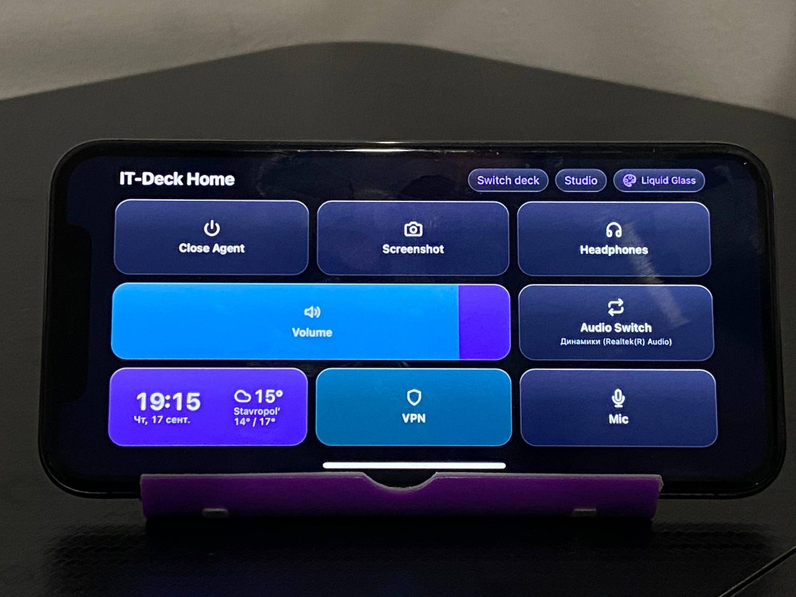
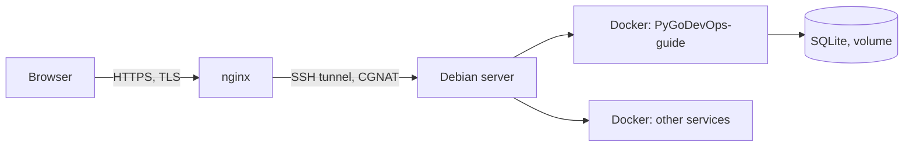

# Hi, I'm Itegin 👋

**Network & system administrator, moving into DevOps.**
21 y.o. · Russia/Kazakhstan · Cybersecurity College grad · currently interning while making the switch.

🇷🇺 [Русская версия](README.ru.md)

---

### About

I run my own home server (Proxmox + Debian, containers, reverse proxy, a VPN and CGNAT tunnel to expose it) and I'm working through Python, Go, Linux internals, Docker, CI/CD and IaC in that order — one guided plan, tracked lesson by lesson. Right now I'm interning and pointing that experience at DevOps.

**Currently learning / using:**

---

### Projects

<table>
<tr>
<td width="50%" valign="top">

**[IT-Deck](https://github.com/Itegin/it-deck)**

An old iPhone becomes a Stream Deck for a Windows PC — real-time tiles (mic, volume, VPN, CPU/RAM), one `.exe`, no server, no Docker, connected over the LAN by QR code.

`Python` `WebSocket` `Windows COM` `PWA`

</td>
<td width="50%" valign="top">

**PyGoDevOps-guide** *(source private)*

A self-hosted learning tracker I built for my own Python → Go → DevOps plan: 12 phases, 77 lessons, per-track progress, theory + practice + self-checks. Runs on my home server.

`Flask` `SQLite` `Docker` `nginx` `CI: ruff + pytest`

[→ live site](https://itgnroadmap.duckdns.org:9443/resume)

</td>
</tr>
</table>

---

### Home server

Everything self-hosted: Proxmox for virtualization, Debian + Docker Compose for services, nginx terminating TLS, an SSH tunnel to get around CGNAT, GitHub Actions running lint/tests/build on every push.

---

### Highlights

- Built and deployed **two self-hosted web services** (Flask, FastAPI) from scratch, both public over nginx + TLS
- Run a **home server**: Proxmox VE for virtualization, Docker Compose for services, an SSH tunnel to get around CGNAT
- **IT-Deck** — public project, actively maintained, tagged releases with CI-built Windows binaries
- **PyGoDevOps-guide** — own 12-phase / 77-lesson curriculum, working through it lesson by lesson while building the tracker itself
- Wrote my own auth, admin panel (draft → publish), and a cookie-free page-view counter — no frameworks, no ORM, no shortcuts

---

<picture>
  <source media="(prefers-color-scheme: dark)" srcset="https://raw.githubusercontent.com/Itegin/itegin/output/github-contribution-grid-snake-dark.svg">
  <source media="(prefers-color-scheme: light)" srcset="https://raw.githubusercontent.com/Itegin/itegin/output/github-contribution-grid-snake.svg">
  
</picture>

Open to remote infrastructure/DevOps roles.
