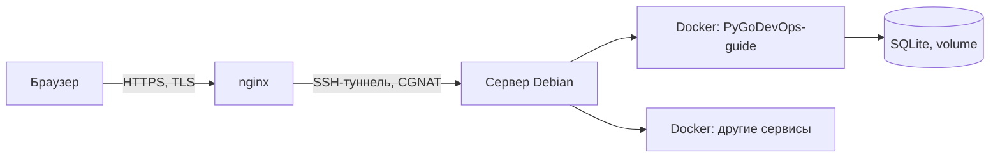

# Привет, я Itegin 👋

**Сетевой и системный администратор, перехожу в DevOps.**
21 год · Россия/Казахстан · выпускник колледжа по кибербезопасности · сейчас на стажировке, параллельно меняю направление.

🇬🇧 [English version](README.md)

---

### Обо мне

У меня свой домашний сервер (Proxmox + Debian, контейнеры, reverse proxy, VPN и туннель через CGNAT, чтобы всё это было видно снаружи), и я прохожу Python, Go, основы Linux, Docker, CI/CD и IaC — по порядку, по собственному плану, урок за уроком. Сейчас стажируюсь и разворачиваю этот опыт в сторону DevOps.

**Сейчас изучаю / использую:**

---

### Проекты

<table>
<tr>
<td width="50%" valign="top">

**[IT-Deck](https://github.com/Itegin/it-deck)**

Старый iPhone становится Stream Deck для Windows-ПК: живые тайлы (микрофон, громкость, VPN, CPU/RAM), один `.exe`, без сервера и Docker, подключение по QR-коду в локальной сети.

`Python` `WebSocket` `Windows COM` `PWA`

</td>
<td width="50%" valign="top">

**PyGoDevOps-guide** *(исходники закрыты)*

Самостоятельный трекер обучения, который я написал под свой план Python → Go → DevOps: 12 фаз, 77 уроков, прогресс по трекам, теория + практика + самопроверка. Крутится на домашнем сервере.

`Flask` `SQLite` `Docker` `nginx` `CI: ruff + pytest`

[→ живой сайт](https://itgnroadmap.duckdns.org:9443/resume)

</td>
</tr>
</table>

---

### Домашний сервер

Всё на самостоятельном хостинге: Proxmox для виртуализации, Debian + Docker Compose для сервисов, nginx терминирует TLS, SSH-туннель обходит CGNAT, GitHub Actions гоняет lint/тесты/сборку при каждом пуше.

---

<b>План обучения</b> (Python → Go → DevOps, 12 фаз)

 

- [x] Основы Python
- [x] Linux и основы сетей
- [ ] Основы Go
- [ ] Docker и контейнеры
- [ ] CI/CD пайплайны
- [ ] Управление конфигурацией (Ansible)
- [ ] Infrastructure as Code (Terraform)
- [ ] Kubernetes / k3s
- [ ] Мониторинг и observability
- [ ] Основы облаков
- [ ] Security hardening
- [ ] Итоговый проект

Полный трекер (исходники закрыты, прогресс публичный): [itgnroadmap.duckdns.org:9443/resume](https://itgnroadmap.duckdns.org:9443/resume)

---

<picture>
  <source media="(prefers-color-scheme: dark)" srcset="https://raw.githubusercontent.com/Itegin/itegin/output/github-contribution-grid-snake-dark.svg">
  <source media="(prefers-color-scheme: light)" srcset="https://raw.githubusercontent.com/Itegin/itegin/output/github-contribution-grid-snake.svg">
  
</picture>

Открыт к удалённым инфраструктурным/DevOps-ролям.
